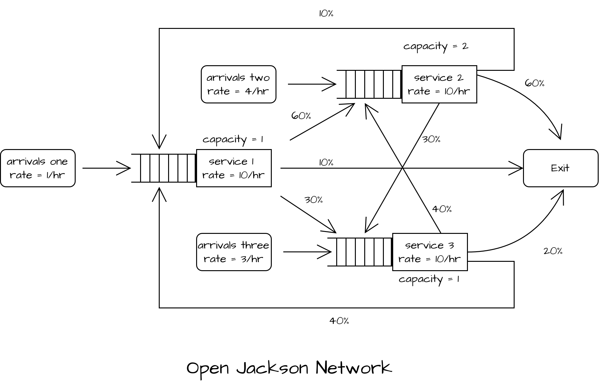

In this example, the model represents a a classic queuing network problem that can be formulated as an Open Jackson Network.

The JSON for this built-in example can be loaded using `json2ciw.datasets.load_jackson_network_model`.

{width=80% fig-align="center" fig-alt="Jackson network"}

## Imports

```{python}
import ciw
import json
from rich import print
import statistics

from json2ciw.datasets import load_jackson_network_model
from json2ciw.engine import (
    CiwConverter,
    multiple_replications
)
from json2ciw.results import (
    summarise_results,
    tidy_to_wide_format
)
from json2ciw.schema import ProcessModel
```

## Load JSON

```{python}
json_network = load_jackson_network_model()
print(json.dumps(json_network, indent=2))
```

## Validate with `ProcessModel`

```{python}
model_instance = ProcessModel(**json_network)
```

```{python}
print(model_instance)
```

```{python}
model_instance.display_diagram(include_resources=False)
```

```{python}
model_instance.display_diagram(include_resources=True)
```

```{python}
model_instance.get_distributions_df()
```

```{python}
model_instance.get_routing_matrix_df()
```

```{python}
model_instance.get_resources_df()
```

## Convert to `ciw` parameters

```{python}
adapter = CiwConverter(model_instance)
network_params = adapter.generate_params()
network_params
```

## Build and run the `ciw` model

```{python}
network = ciw.create_network(**network_params)
sim = ciw.Simulation(network)
sim.simulate_until_max_time(50)
print("Quick simulation run worked!")
```

## Run the model for multiple replications

```{python}
df_reps = multiple_replications(
    network, 
    model_instance, 
    num_reps=5, 
    runtime=2880,
    warmup=1440
)

df_reps.head()
```

## Convert to wide format

```{python}
wide = tidy_to_wide_format(df_reps)
wide.head()
```

## Summarise results

```{python}
summary = summarise_results(df_reps)
summary.round(1)
```
